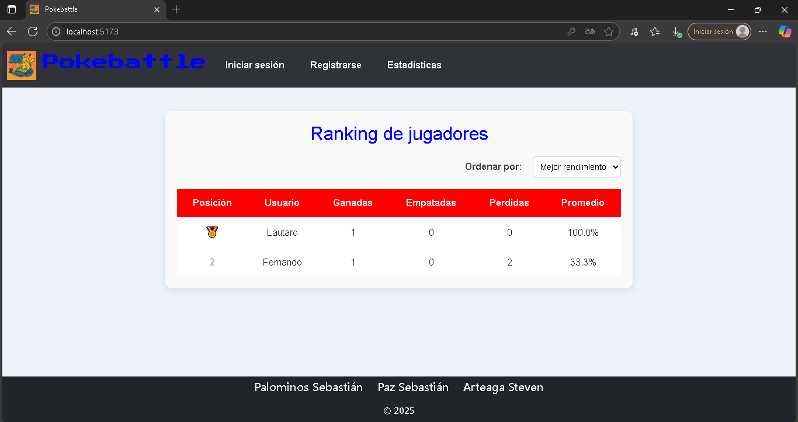
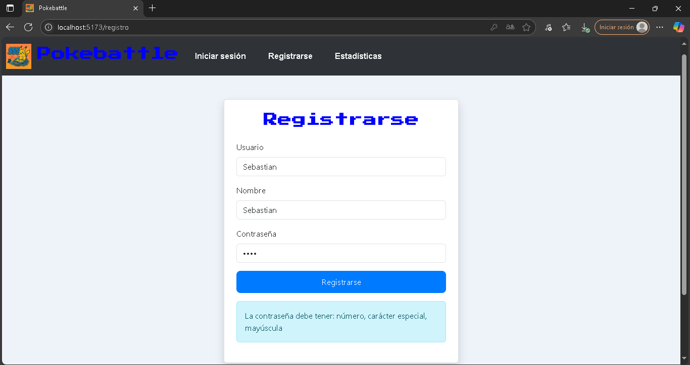
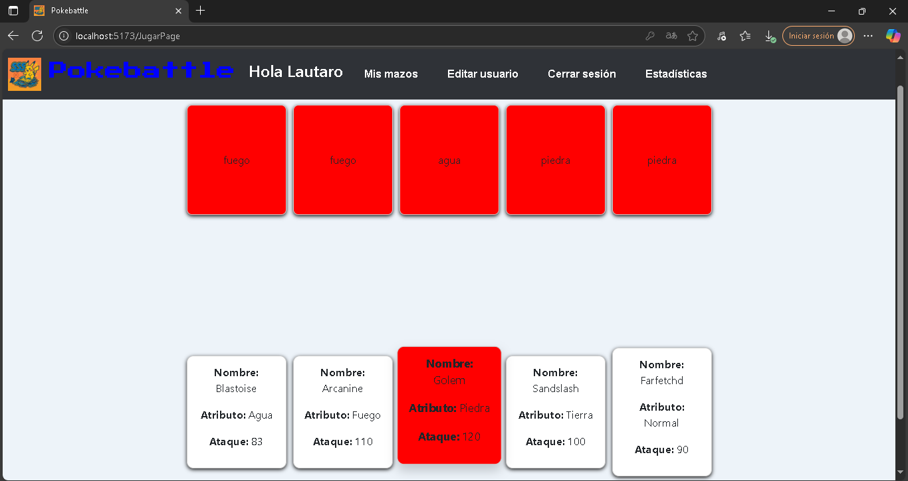
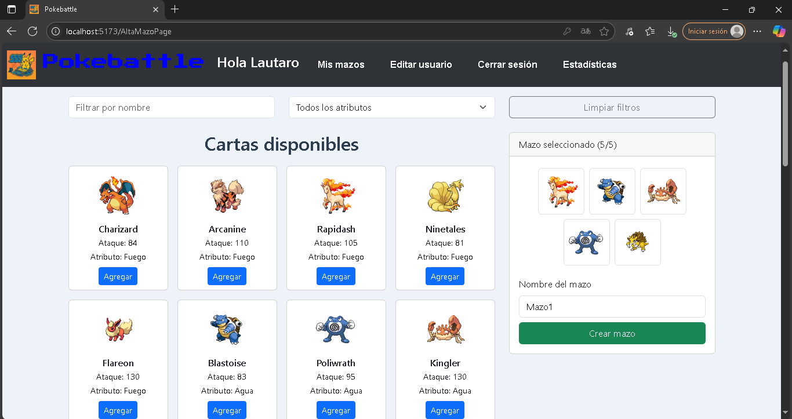

# 📚 Juego de Cartas

Este es un pequeño y simple juego de cartas inspirado ligueramente en **Pokémon**, desarrollado como base para aprender desarrollo **web fullstack**.

Este proyecto comenzó como un trabajo práctico realizado junto a otros dos compañeros para la materia "Seminario de Lenguaje" de la **Licenciatura en Informática** en la **Universidad Nacional de La Plata (UNLP)** en 2025.

Actualmente estoy ampliándolo y mejorándolo de forma individual para profundizar mis conocimientos en **React**, **Bootstrap**, **PHP**, control de versiones con **Git** y buenas prácticas de desarrollo.  
Además, estoy trabajando en migrar el backend a **Laravel**, mejorando la estructura, la seguridad y la experiencia de usuario, con el objetivo de publicarlo como parte de mi portafolio profesional.

## 🎮 Funcionalidades principales

**Estructura general:**
- **Header con navegación y branding:** presente en todas las páginas, muestra el logo, el nombre "Pokebattle" y un menú de navegación adaptable.
- **Footer informativo:** visible en todo momento, muestra los nombres de los integrantes del equipo original y el año de creación del proyecto.

**Navegación dinámica:**
- El menú muestra **registro, login y estadísticas** cuando no hay sesión iniciada.
- Una vez logueado, el menú se actualiza para mostrar:
  - Nombre del usuario autenticado.
  - Acceso a *Mis mazos*.
  - Página de edición de usuario.
  - Página de estadísticas.
  - Botón de cerrar sesión.

**Homepage / Estadísticas:**
- Página principal que muestra las estadísticas globales de partidas:
  - Total de victorias, derrotas y empates.
  - Promedio de rendimiento (victorias sobre partidas jugadas).
  - Opciones de ordenamiento: de mejor a peor promedio o viceversa.

**Registro de usuarios:**
- Formulario para crear nuevos usuarios mediante **APIs propias en PHP Slim**, usando **Axios** desde React.
- Validación de datos con validacónes de seguridad (contraseñas con caracteres especiales y cantidad minima de letras).

**Login y autenticación:**
- Inicio de sesión que genera y guarda un **token JWT**, manteniendo la sesión activa.
- Validación de expiración de token para proteger rutas y operaciones.

**Gestión de usuario:**
- Página de edición de usuario:
  - Modificar nombre.
  - Cambiar contraseña con validaciones.

**Gestión de mazos:**
- Página *Mis mazos*:
  - Muestra hasta 3 mazos creados por usuario.
  - Opciones para:
    - Ver cartas dentro de cada mazo.
    - Editar el nombre del mazo.
    - Eliminar mazos.
    - Iniciar una partida usando un mazo.
  - Si el usuario no alcanzó el límite de mazos, puede crear uno nuevo.

- Página *Crear mazo*:
  - Muestra un catálogo de todas las cartas posibles.
  - Filtros por nombre y por tipo (agua, fuego, planta, etc.).
  - Permite seleccionar 5 cartas y definir un nombre para el nuevo mazo.

**Mecánica de juego:**
- Página de juego:
  - El usuario elige un mazo y selecciona cartas.
  - El servidor elige cartas para enfrentarlas.
  - Se juega al mejor de 5: gana la carta más fuerte de cada ronda.
  - Se actualizan estadísticas según el resultado.

**Seguridad y validaciones:**
- Validación de expiración de tokens para proteger páginas restringidas.
- Validación de datos en formularios (ej: contraseñas fuertes).
- Manejo de errores y mensajes al usuario.

## 🛠️ Tecnologías usadas

| Parte                    | Tecnologías y herramientas                                                |
|--------------------------|---------------------------------------------------------------------------|
| **Frontend**             | React, Vite, Bootstrap, React Router, Axios                               |
| **Backend**              | PHP Slim Framework (migración en curso a Laravel), JWT para autenticación |
| **Base de datos**        | MySQL (estructura de tablas provista por la cátedra)                      |
| **Control de versiones** | Git, GitHub                                                               |

## 📸 Screenshots

A continuación se muestran algunas capturas del proyecto en funcionamiento:

### 🏠 Página de inicio (Estadísticas)


### 🔐 Formulario de Registro


### 🎮 Juego de Cartas en acción


### 📊 Creación de Mazo


## 🚀 Cómo ejecutar localmente

Para correr este proyecto en tu entorno local, sigue estos pasos:

### 1️⃣ Clonar el repositorio

```bash
git clone https://github.com/sebastianpaz04/pokebattle.git
cd pokebattle

```
### 2️⃣ Instalar y correr el Frontend
```bash
cd frontend
npm install
npm run dev
```
### 3️⃣ Instalar y correr el Backend
```bash
cd backend
composer install
php -S localhost:8000 -t public
```

### ✅ Requisitos previos
Node.js y npm instalados para el frontend.
PHP y Composer instalados para el backend.
Servidor de base de datos MySQL corriendo con la estructura provista.

## 🗂️ Estructura de la base de datos

La estructura de la base de datos se encuentra en el archivo [`seminariophp.sql`](./docs/seminariophp.sql).
Para restaurar la base de datos, importa el archivo en tu servidor MySQL.

## 📄 Licencia

Uso académico y personal. Puedes utilizarlo como base para tu propio aprendizaje.

## 👨‍💻 Autor, créditos y contactos

Desarrollado por Sebastián Paz, proyecto original junto a Sebastián Palomino y Steven Arteaga compañeros de la Licenciatura en Informática - UNLP.
Expandido y mantenido como proyecto personal de aprendizaje.

📫 **Email:** [cbk.paz.75@gmail.com](mailto:cbk.paz.75@gmail.com)
💼 **LinkedIn:** [linkedin.com/in/sebastián-paz](https://www.linkedin.com/in/sebastián-paz)

¡Gracias por visitar este proyecto! 🎉
